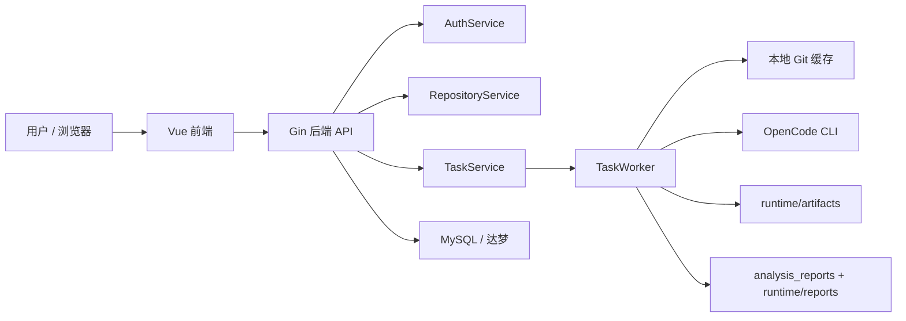

# GitImpact

GitImpact 是一个面向代码变更影响分析的前后端一体化平台。它接收两个 Git 引用之间的差异，自动准备分析材料，调用 OpenCode CLI 生成 Markdown 与结构化 JSON 报告，并把任务状态、日志、产物和报告统一保存，便于研发、测试和发布前评估使用。

## 项目解决的问题

- 让代码评审、发布评估和回归范围分析不再依赖口头经验。
- 把 `git diff`、提交历史、影响点提示词、分析报告沉淀为可追溯任务。
- 为团队提供一个可以二次开发的分析工作台，而不是一次性脚本。

## 核心能力

- 用户注册、登录、JWT 鉴权，以及 `config|db|mixed` 三种认证模式。
- 维护待分析仓库记录，并支持手动 `git clone` / `git fetch` 更新缓存。
- 创建分析任务，比较两个仓库引用之间的差异。
- 生成 `changed_files.txt`、`diff.patch`、`commit_log.txt`、`repo_manifest.md`、提示词文件等任务材料。
- 调用 OpenCode CLI 生成 Markdown 报告和结构化 JSON 报告。
- 保存任务状态、日志、产物路径、原始 stdout/stderr 和最终报告。
- 提供一个可运行但仍偏原型化的 Vue 前端界面。
- 支持前端先联网构建、再由后端统一托管 `dist` 的离线部署模式。

## 系统架构总览



图中的关键事实与当前代码保持一致：

- 后端入口在 `backend/cmd/server/main.go`。
- 任务执行是进程内 goroutine worker，不是独立队列系统。
- OpenCode 当前真实实现只有 CLIAnalyzer；ServerAnalyzer 仍是占位实现。

## 技术栈

- 后端：Go 1.22、Gin、GORM、JWT、bcrypt
- 数据库：MySQL、达梦
- 前端：Vue 3、Vite、Pinia、Vue Router、Element Plus
- 构建：Makefile、Dockerfile
- 分析引擎：OpenCode CLI

## 目录结构

```text
.
├─ backend/              后端代码、配置示例、vendor 依赖
├─ frontend/             前端源码与构建配置
├─ docs/                 面向使用者与维护者的详细文档
├─ scripts/              开发辅助脚本
├─ sql/                  MySQL / 达梦初始化 SQL
├─ examples/             示例任务与示例报告
├─ Makefile              构建、测试、Docker 命令入口
└─ Dockerfile            后端镜像构建文件
```

更细的目录职责说明见：

- [系统总览](./docs/architecture-overview.md)
- [后端架构](./docs/backend-architecture.md)
- [前端架构](./docs/frontend-architecture.md)

## 快速启动

### 1. 准备环境

- Go 1.22+
- Node.js 18+
- npm 9+
- Git
- MySQL 8+ 或 达梦数据库
- OpenCode CLI，可通过 `opencode` 命令访问

### 2. 初始化项目

```bash
./scripts/init-dev.sh
```

脚本会复制 `backend/config.example.yaml` 为 `backend/config.yaml`。

### 3. 初始化数据库

MySQL：

```bash
mysql -uroot -proot < sql/mysql/init.sql
```

达梦：

- 使用达梦客户端连接目标 schema。
- 执行 `sql/dameng/init.sql`。

### 4. 准备后端配置

按需修改 `backend/config.yaml`。最少要确认：

- `auth.mode`
- `auth.jwt_secret`
- `database.type`
- `database.dsn` 或 `database.dameng.*`
- `opencode.binary_path`
- `workdir.*`

完整字段说明见 [配置参考](./docs/config-reference.md)。

### 5. 启动后端

```bash
./scripts/dev-backend.sh
```

或：

```bash
cd backend
GITIMPACT_CONFIG=./config.yaml go run ./cmd/server
```

### 6. 启动前端

```bash
./scripts/dev-frontend.sh
```

前端默认运行在 `http://127.0.0.1:5173`，后端默认运行在 `http://127.0.0.1:8080`。
开发环境下前端请求仍然走相对 `/api`，由 Vite 代理到后端，不再硬编码生产 API 地址。

## 前端离线部署总览

项目现已采用“前端 dist 由后端统一托管”的单服务部署方案：

1. 在联网构建环境执行一次前端构建。
2. 构建产物输出到 `frontend/dist/`。
3. 构建脚本把 `frontend/dist/` 同步到 `backend/web/dist/`。
4. 后端启动后直接托管 `backend/web/dist/`。
5. 生产环境和离线环境都通过相对路径 `/api` 调用后端，无需再启动 Vite dev server。

这意味着：

- 联网只发生在前端依赖安装和前端构建阶段。
- 离线部署阶段不需要 `npm install`。
- history 路由刷新由后端回退到 `index.html` 处理。

详细说明见：

- [前端离线部署指南](./docs/frontend-offline-deployment.md)
- [前端构建与打包指南](./docs/frontend-build-and-package.md)
- [部署指南](./docs/deployment-guide.md)

## 最小可运行示例

最快验证链路的方法：

1. 使用 MySQL 初始化 `gitimpact` 库。
2. 保持 `backend/config.yaml` 中 `auth.mode: mixed`，并保留示例里的 `config_users`。
3. 启动后端。
4. 调用登录接口：

```bash
curl -X POST http://127.0.0.1:8080/api/auth/login \
  -H "Content-Type: application/json" \
  -d "{\"username\":\"config_admin\",\"password\":\"Admin@123456\"}"
```

5. 创建一个仓库记录，`local_cache_dir` 指向本机可写目录。
6. 执行仓库抓取接口。
7. 用 [examples/sample-task.json](./examples/sample-task.json) 的结构创建任务。
8. 轮询任务详情、日志和报告接口。

完整演示路径见 [开发指南](./docs/development-guide.md)。

## 配置说明入口

- [配置参考](./docs/config-reference.md)
- [数据库设计](./docs/database-design.md)
- [部署指南](./docs/deployment-guide.md)

## API 文档入口

- [API 参考](./docs/api-reference.md)
- [认证说明](./docs/backend-architecture.md#请求处理链路)

## 开发调试说明入口

- [开发指南](./docs/development-guide.md)
- [任务链路说明](./docs/task-flow.md)
- [OpenCode 集成说明](./docs/opencode-integration.md)
- [排障指南](./docs/troubleshooting.md)

## 常见问题入口

- [FAQ](./docs/faq.md)
- [术语表](./docs/glossary.md)

## 部署说明入口

- [部署指南](./docs/deployment-guide.md)
- [Docker 构建说明](./docs/deployment-guide.md#docker-构建与运行)
- [前端离线部署指南](./docs/frontend-offline-deployment.md)

## vendor 依赖策略

- 后端默认通过 `GOFLAGS=-mod=vendor` 构建与测试。
- `backend/vendor/` 已提交到仓库，Dockerfile 也按 vendor 模式构建。
- 这意味着正常构建路径不应在构建时联网拉取 Go 依赖。
- 如果 `go.mod` / `go.sum` 与 `vendor/` 不一致，需要显式执行 `go mod vendor` 同步。

## 构建与测试

```bash
make build
make test
make build-linux-amd64
make frontend-build
make verify-offline
docker build -t gitimpact/backend:test .
```

构建细节与交叉编译说明见 [开发指南](./docs/development-guide.md) 和 [部署指南](./docs/deployment-guide.md)。
