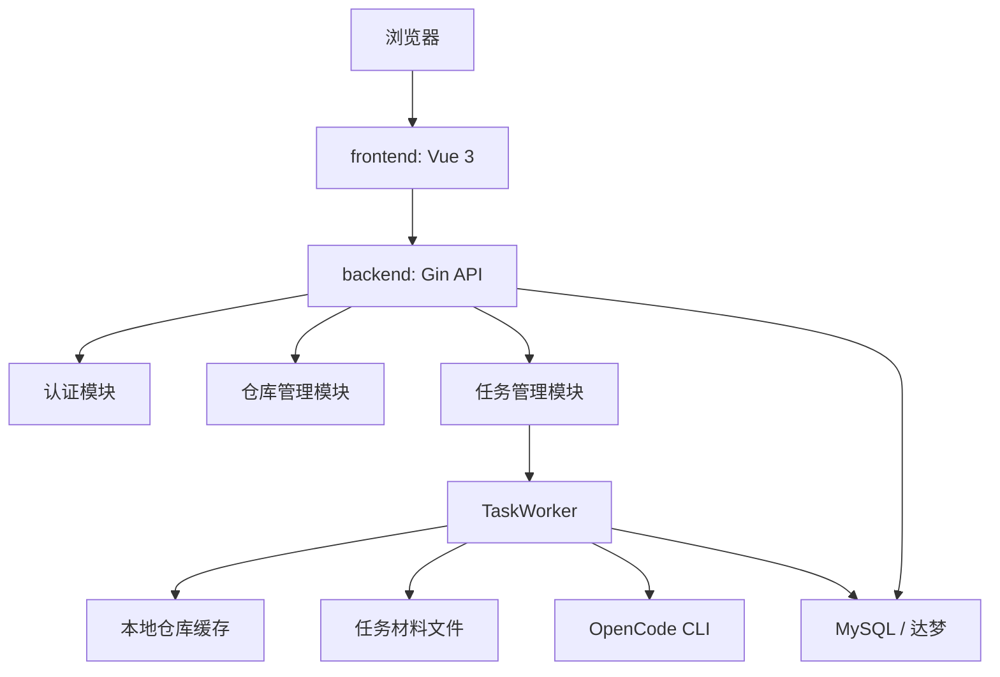
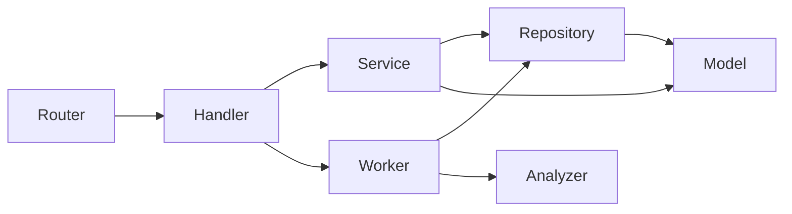

# 系统架构总览

## 系统整体架构

GitImpact 采用单仓库组织方式，包含后端服务、前端原型、数据库初始化脚本、开发脚本和文档。

当前代码体现出的架构特点：

- 后端是主系统，前端只是一个围绕现有 API 的轻量使用壳。
- 数据库同时保存业务实体和分析结果。
- 影响分析的关键输入是 worker 生成的本地材料文件，而不是直接把仓库交给 OpenCode 自行抓取。

## 前后端分层说明

后端：

- `router` 负责路由注册。
- `handler` 负责 HTTP 入参、出参与状态码。
- `service` 负责业务规则。
- `repository` 负责 GORM 数据访问。
- `worker` 负责异步任务执行。
- `analyzer` 负责封装 OpenCode 调用方式。

前端：

- `router` 负责页面路由。
- `stores/auth.ts` 负责登录态。
- `api/http.ts` 负责 axios 实例和 JWT 注入。
- `views/*` 负责各页面最小交互。

## 模块依赖关系

依赖方向总体保持清晰，但有两个需要维护者注意的点：

- `TaskHandler` 直接持有 `TaskWorker`，因此创建任务时 HTTP 层会直接触发异步执行。
- `TaskWorker` 同时依赖多个 repository，因此它是跨模块编排中心。

## 任务从提交到生成报告的完整链路

1. 用户通过前端或 API 提交任务。
2. `TaskHandler.Create` 绑定请求体并写入 `created_by`。
3. `TaskService.CreateTask` 把任务状态设置为 `pending` 后入库。
4. `TaskWorker.Enqueue` 启动 goroutine。
5. worker 把任务改为 `running`，同时写入任务日志。
6. worker 准备 old/new 两侧仓库缓存并切换到目标 ref。
7. worker 生成差异材料与提示词文件。
8. worker 调用 `CLIAnalyzer` 执行 `opencode run`。
9. worker 把 Markdown、JSON、stdout、stderr 保存为报告。
10. worker 更新任务为 `success` 或 `failed`。

详细步骤见 [任务流转说明](./task-flow.md)。

## 为什么这样分层

- 把持久化和业务规则分开，方便后续替换数据库实现或增加缓存。
- 把 OpenCode 调用放在 `analyzer` 层，便于未来从 CLI 切换到 Server/SDK。
- 把异步逻辑集中在 worker，可以让 HTTP 请求尽快返回。

## 当前限制

- 任务队列是进程内 goroutine，不具备跨进程调度和恢复能力。
- `ServerAnalyzer` 还是占位实现。
- 前端页面多为原型展示，缺少完整的表单校验、错误提示和管理视图。
- 任务执行时会直接在仓库缓存目录执行 `git checkout`，并发任务可能互相影响。

## 后续扩展点

- 引入持久化任务队列或独立 worker 进程。
- 为任务产物和报告提供文件浏览接口。
- 引入更细粒度的权限模型。
- 扩展分析器实现，支持 Server/SDK 模式或多模型策略。
