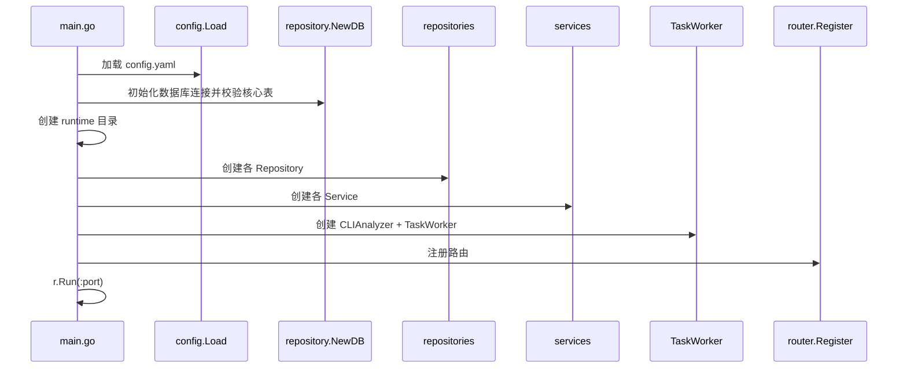
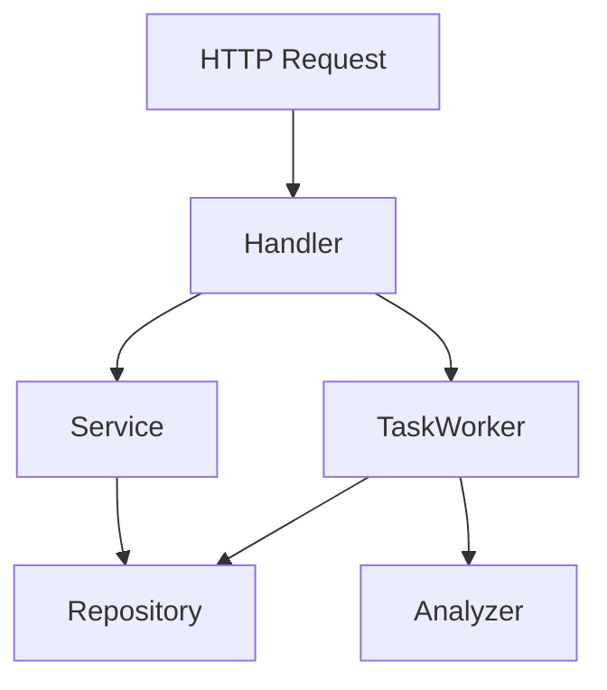

# 后端架构

## backend 各目录职责

- `cmd/server`：程序启动入口。
- `internal/analyzer`：OpenCode 分析器接口与实现。
- `internal/config`：配置结构与 YAML 加载。
- `internal/controller`：预留目录，当前没有实际业务控制器。
- `internal/handler`：Gin handler。
- `internal/middleware`：JWT 中间件。
- `internal/model`：GORM 模型和跨层常量。
- `internal/repository`：数据库访问层。
- `internal/router`：路由注册表。
- `internal/service`：业务逻辑层。
- `internal/utils`：结构化报告解析等工具。
- `internal/worker`：任务异步执行。
- `pkg/auth`：JWT 签发与解析。
- `pkg/response`：统一响应结构。
- `vendor`：离线构建依赖。

## main 启动流程

## 各层职责

### config

- 定义配置模型。
- 填充默认端口、JWT 过期时间、OpenCode 超时时间。

### repository

- 选择 MySQL 或达梦驱动。
- 默认不执行 `AutoMigrate`，仅在显式开启配置时执行（不推荐达梦开启）。
- 启动阶段校验核心表是否已通过 `sql/mysql/init.sql` 或 `sql/dameng/init.sql` 初始化。
- 提供实体 CRUD、任务日志与产物写入。

### service

- `AuthService`：注册、登录校验、默认管理员初始化、JWT 生成。
- `RepositoryService`：仓库 CRUD 和 `git clone/fetch`。
- `TaskService`：任务创建、日志与报告查询。
- `SettingService`：系统设置键值对读写。

### handler

- 解析 HTTP 请求体与路径参数。
- 调用 service。
- 映射响应码和统一响应格式。

### router

- 组织 `/healthz`、`/api/auth/*`、`/api/repositories/*`、`/api/tasks/*`、`/api/settings/*`。

### worker

- 管理任务状态流转。
- 拉取仓库、切换 ref。
- 生成分析材料。
- 调用分析器并保存结果。

### analyzer

- `CLIAnalyzer`：执行 `opencode run`。
- `ServerAnalyzer`：当前未实现。

## 层之间的调用关系

## 依赖注入和对象装配关系

对象装配全部发生在 `backend/cmd/server/main.go`：

1. 创建数据库连接。
2. 基于同一个 `*gorm.DB` 创建各个 repository。
3. 把 repository 注入 service。
4. 把 `config + analyzer + repositories` 注入 `TaskWorker`。
5. 把 service 和 worker 注入 handler。
6. 最后把 handler 与 `jwtSecret` 注入 router。

当前没有使用容器框架，装配关系简单直接，适合小型项目维护。

## 请求处理链路

以 `POST /api/tasks` 为例：

1. `JWT` 中间件解析 Bearer Token。
2. `TaskHandler.Create` 绑定请求体。
3. handler 从上下文读取 `user_id` 写入 `CreatedBy`。
4. `TaskService.CreateTask` 设置状态为 `pending` 并入库。
5. handler 调用 `TaskWorker.Enqueue`。
6. API 立即返回，worker 后台继续执行。

## 错误处理链路

- 绑定参数失败：handler 返回 `400`。
- 登录失败：handler 返回 `401`。
- 数据不存在：handler 多数返回 `404`。
- Git 或 OpenCode 失败：worker 写入任务失败状态与错误日志。
- Markdown 报告执行失败时，worker 仍会尽量保存原始 stdout/stderr。

## 日志和任务状态流转

任务状态：

- `pending`
- `running`
- `success`
- `failed`

任务日志：

- 启动时写入 `task started`
- 成功时写入 `task completed`
- 失败时写入错误信息

维护者需要知道的真实边界：

- 当前日志记录较少，主要用于判定阶段，不是完整审计日志。
- 任务重试机制尚未实现。
