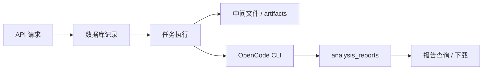

# 数据流说明

## 总览

## 输入数据

输入主要来自四类来源：

- 配置文件 `backend/config.yaml`
- HTTP 请求体
- Git 仓库缓存
- OpenCode CLI 输出

## 数据库记录

持久化到数据库的主要对象：

- `users`
- `repositories`
- `analysis_tasks`
- `analysis_reports`
- `task_logs`
- `task_artifacts`
- `system_settings`

## 中间文件

任务执行时会在 `workdir.artifacts/task_<id>_<timestamp>` 下生成：

- `changed_files.txt`
- `diff.patch`
- `commit_log.txt`
- `repo_manifest.md`
- `analysis_prompt.md`
- `analysis_prompt_json.md`

这些属于临时但很有价值的排障材料。

## 最终报告

最终报告以数据库记录为主：

- `analysis_reports.markdown_report`
- `analysis_reports.structured_report`
- `analysis_reports.raw_stdout`
- `analysis_reports.raw_stderr`

下载接口从数据库中取内容，并不依赖文件系统上的报告副本。

## 哪些是临时产物，哪些是持久化产物

临时产物：

- worker 目录下的中间分析文件
- 仓库切换过程中的本地工作树状态

持久化产物：

- 数据库表中的业务记录
- `task_artifacts` 中登记的产物路径
- 仓库缓存目录本身

## 目录落盘规则

- `workdir.root`：运行时根目录
- `workdir.repo_cache`：仓库缓存
- `workdir.artifacts`：任务材料
- `workdir.reports`：预留报告目录，当前代码没有明显写入正文文件

## 数据清理建议

- 定期清理过旧的 `artifacts` 目录，避免磁盘膨胀
- 根据任务生命周期清理无效仓库缓存
- 对报告和日志制定保留策略
- 如果补充了文件型报告导出，需同步纳入清理范围
