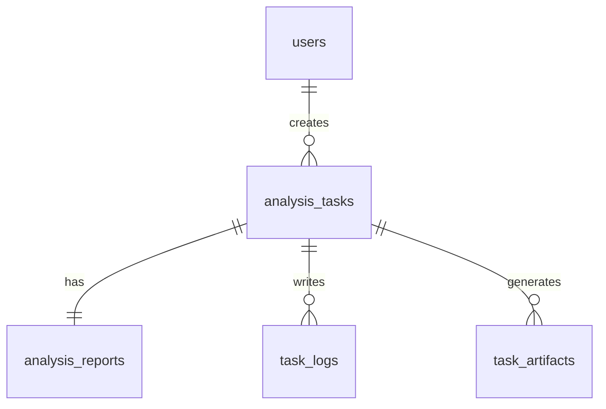

# 数据库设计

## 数据库类型

当前后端运行时只支持两种数据库：

- MySQL
- 达梦

虽然 `go.mod` 中包含 SQLite 驱动，但它只用于测试，不属于运行时支持矩阵。

## 初始化 SQL

- MySQL：`sql/mysql/init.sql`
- 达梦：`sql/dameng/init.sql`

同时，后端启动时会执行 `AutoMigrate`，用于保证最小可运行结构存在。正式环境仍建议先执行初始化 SQL，再启动服务。

## 数据实体

当前代码没有在数据库层声明外键约束，但业务上存在以上关联关系。

## 表结构职责

### `users`

- 数据库用户表
- 仅存储数据库用户，不存储 `config_users`
- 关键字段：
  - `username`
  - `password_hash`
  - `role`
  - `status`
  - `source`
  - `last_login_at`

### `repositories`

- 仓库元数据表
- 关键字段：
  - `name`
  - `repo_url`
  - `default_branch`
  - `local_cache_dir`
  - `auth_note`

### `analysis_tasks`

- 分析任务主表
- 关键字段：
  - `task_name`
  - `mode`
  - `old_repo_id`
  - `old_ref`
  - `new_repo_id`
  - `new_ref`
  - `generate_markdown`
  - `generate_structured`
  - `custom_focus`
  - `status`
  - `error_message`
  - `created_by`

### `analysis_reports`

- 任务报告表
- 与 `analysis_tasks.task_id` 一对一
- 保存 Markdown、结构化 JSON，以及 OpenCode 原始 stdout/stderr

### `task_logs`

- 任务执行日志表
- 当前主要保存 `task started`、`task completed` 和错误日志

### `task_artifacts`

- 任务中间产物表
- 保存产物名称和文件路径，例如：
  - `changed_files.txt`
  - `diff.patch`
  - `commit_log.txt`
  - `repo_manifest.md`
  - `analysis_prompt.md`
  - `analysis_prompt_json.md`

### `system_settings`

- 简单键值对配置表
- 当前没有更复杂的配置分组或版本机制

## 典型数据流转过程

1. 用户登录后发起任务。
2. `analysis_tasks` 新增一条 `pending` 记录。
3. worker 开始执行后，把任务更新为 `running`。
4. 任务中间产物写入磁盘，同时在 `task_artifacts` 中登记。
5. worker 产生执行日志，写入 `task_logs`。
6. 报告写入 `analysis_reports`。
7. 任务状态更新为 `success` 或 `failed`。

## MySQL / 达梦差异

- 自增主键：
  - MySQL：`AUTO_INCREMENT`
  - 达梦：`IDENTITY(1,1)`

- 大文本字段：
  - MySQL：`LONGTEXT`
  - 达梦：`CLOB`

- 布尔值：
  - MySQL：`TINYINT(1)`
  - 达梦：`SMALLINT`

- 时间默认值语法和更新行为存在差异，因此仓库分别提供了两套 SQL。

## 当前设计上的注意点

- 表之间没有硬性外键，删除上游记录时需要应用层自行保证一致性。
- `created_by` 对配置用户会写入 `0`，这是当前登录模型的自然结果。
- 报告正文同时保存到数据库，若报告很大，需要关注数据库容量与备份策略。
