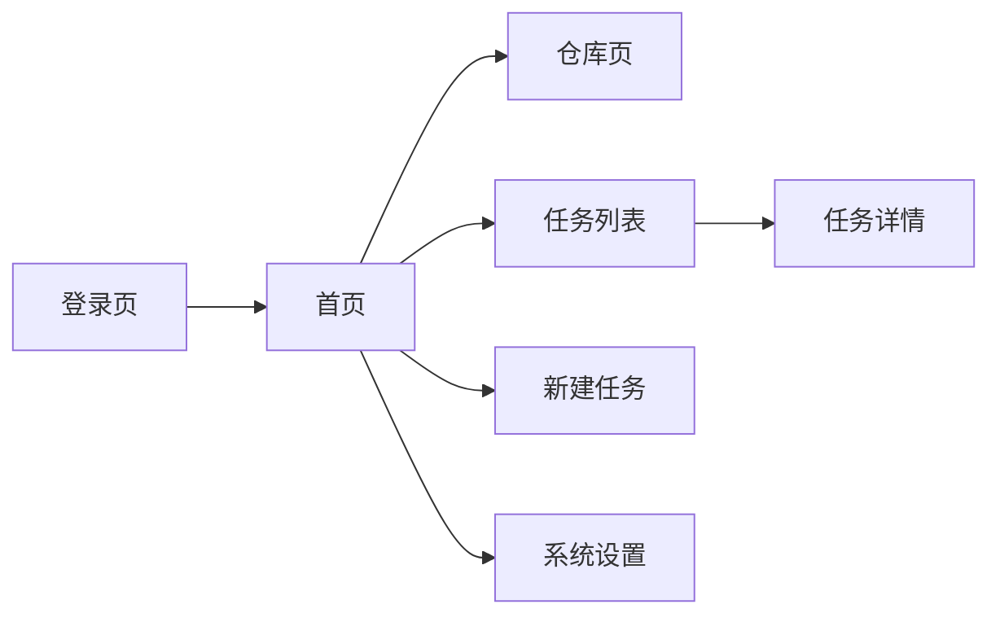

# 前端架构

## 当前定位

`frontend/` 是一个可运行的 Vue 3 前端，但它更接近“原型化工作台”而不是完整生产控制台。页面已经覆盖登录、注册、仓库列表、任务创建、任务列表、任务详情、系统设置等主路径，但不少页面仍以 `pre` 原样展示 API 结果。

## 前端目录结构

- `src/main.ts`：应用入口，挂载 Pinia、Router、Element Plus。
- `src/App.vue`：根组件，仅渲染当前路由。
- `src/api/http.ts`：axios 实例，统一注入 JWT。
- `src/router/index.ts`：路由表和登录守卫。
- `src/stores/auth.ts`：认证状态存储。
- `src/views/*`：页面组件。

## 页面/组件职责

- `LoginView.vue`：登录并保存 token。
- `RegisterView.vue`：注册数据库用户。
- `DashboardView.vue`：入口导航页。
- `RepositoriesView.vue`：查看仓库列表。
- `TaskCreateView.vue`：创建任务。
- `TaskListView.vue`：查看任务列表。
- `TaskDetailView.vue`：查看任务详情与报告。
- `SettingsView.vue`：查看系统设置。

## 状态管理方式

- 使用 Pinia。
- 当前只有 `auth` store。
- `token` 与 `user` 保存在 store 中。
- `token` 会同步到 `localStorage`，刷新页面后仍可继续使用。

## API 调用方式

- 统一使用 `src/api/http.ts` 创建的 axios 实例。
- `baseURL` 来自 `VITE_API_BASE_URL`，默认使用相对 `/api`。
- 请求发出前会尝试从 `localStorage` 读取 `token` 并设置 `Authorization: Bearer <token>`。

这意味着：

- 开发模式与生产模式都可以保持同一套 API 路径。
- 开发模式依赖 Vite 代理；生产模式依赖浏览器同源访问后端。

## 登录态管理

路由守卫逻辑在 `router/index.ts`：

- 未登录时，只允许访问 `/login` 和 `/register`。
- 已登录访问 `/login` 时会跳到 `/`。

需要注意：

- 前端不会主动调用 `/api/auth/me` 恢复用户详情。
- `logout()` 只清理本地状态，没有服务端吊销。

## 页面交互主流程

## 现状和边界

- `TaskCreateView.vue` 当前把 `old_repo_id/new_repo_id` 默认写死为 `1`，是最小演示路径，不是完整任务配置器。
- 仓库页、任务页、设置页都缺少更友好的表格与错误提示。
- 没有统一布局、导航栏和权限展示。
- 页面样式非常轻量，适合调试，不适合作为最终产品界面。
