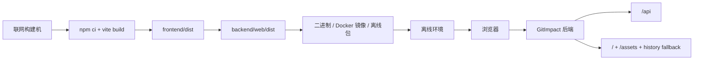

# 前端离线部署指南

## 当前问题

改造前项目存在以下离线部署缺口：

- 前端 API 地址硬编码为 `http://127.0.0.1:8080`
- 后端不托管前端静态资源
- Vue Router 使用 history 模式，但没有后端 fallback
- 根 Dockerfile 只构建后端，没有把前端纳入最终产物
- `scripts/dev-frontend.sh` 每次启动都会 `npm install`
- 没有统一的前端构建、发布、离线打包与验证脚本

## 改造目标

目标形态是：

1. 联网构建环境执行前端构建。
2. 生成稳定的 `frontend/dist/`。
3. 自动同步到 `backend/web/dist/`。
4. 离线环境只启动后端即可访问前端。
5. 离线环境不执行 `npm install`。

## 最终部署架构



## 目录结构说明

关键目录：

- `frontend/dist/`：前端原始构建产物
- `backend/web/dist/`：后端实际托管的前端静态资源
- `artifacts/release/`：联合构建输出
- `artifacts/offline/`：离线部署包输出

## 在线构建步骤

### 1. 前端构建并同步到后端

```powershell
powershell -ExecutionPolicy Bypass -File scripts/build-frontend.ps1
```

这个脚本会：

- 在 `frontend/` 执行 `npm ci`
- 执行 `npm run build:offline`
- 把 `frontend/dist/` 同步到 `backend/web/dist/`

### 2. 联合构建发布目录

```powershell
powershell -ExecutionPolicy Bypass -File scripts/build-release.ps1
```

### 3. 生成离线部署包

```powershell
powershell -ExecutionPolicy Bypass -File scripts/package-offline.ps1
```

## 离线部署步骤

### 单服务二进制部署

1. 在联网环境生成离线包。
2. 把离线包复制到目标机器。
3. 解压后复制 `config.example.yaml` 为 `config.yaml` 并修改数据库、JWT、OpenCode 等配置。
4. 启动后端二进制。
5. 浏览器访问后端地址，例如 `http://host:8080/`。

离线环境不需要：

- Node.js
- npm
- `npm install`
- Vite dev server

### Docker 单镜像部署

联网构建：

```bash
docker build -t gitimpact/all-in-one:latest .
```

离线环境：

- 导入镜像
- 挂载或复制配置文件
- 运行容器

## 前后端联调方式

开发模式：

- 前端运行在 `5173`
- 前端 API 仍使用相对 `/api`
- Vite 会把 `/api` 和 `/healthz` 代理到 `http://127.0.0.1:8080`

生产/离线模式：

- 不再启动 Vite
- 前端页面直接由后端托管
- API 仍访问相对 `/api`

## history 路由如何处理

后端在 `router.Register` 中注册了前端 fallback：

- 命中真实静态文件时，直接返回文件
- 命中非 `/api` 且无扩展名的路径时，返回 `index.html`
- `/api/*` 丢失路由不会被前端接管，仍返回 API 404

## 是否需要 Node

- 在线构建前端：需要 Node.js 18+、npm 9+
- 离线部署运行：不需要 Node

## 哪一步需要联网

- `npm ci`
- 首次 Docker 前端构建阶段拉 Node 镜像和 npm 依赖

## 哪一步不需要联网

- 已构建产物的离线部署
- 后端启动
- 前端页面访问

## 如何验证没有公网依赖

使用：

```powershell
powershell -ExecutionPolicy Bypass -File scripts/verify-offline.ps1
```

它会：

- 构建并同步前端 dist
- 检查 built dist 中是否残留常见公网依赖模式
- 执行路由测试，验证静态托管和 SPA fallback

## 常见问题

- 页面打开白屏：检查 `backend/web/dist/index.html` 是否存在
- 刷新二级路由 404：检查后端版本是否包含新的静态 fallback
- API 请求到 5173 失败：说明你仍在开发模式下，且后端未启动或代理目标不通
- 离线机器访问不了页面：确认前端是否已经同步到 `backend/web/dist/`
