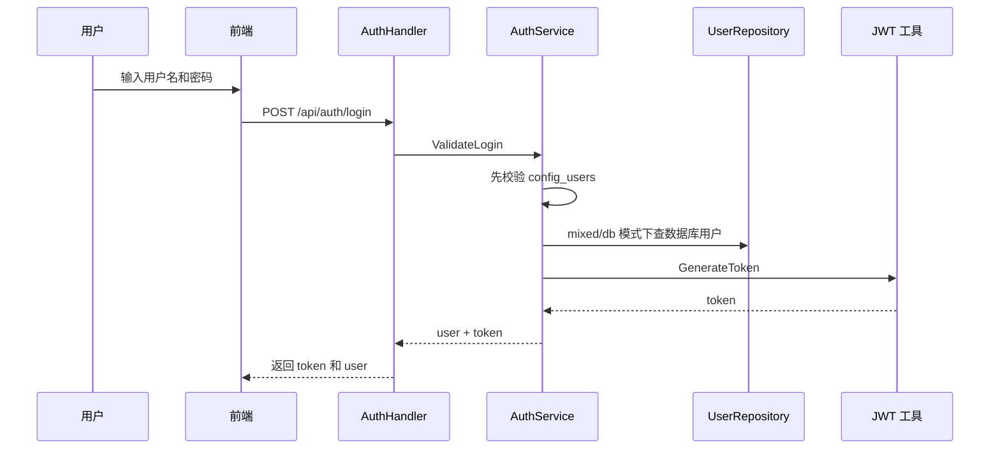
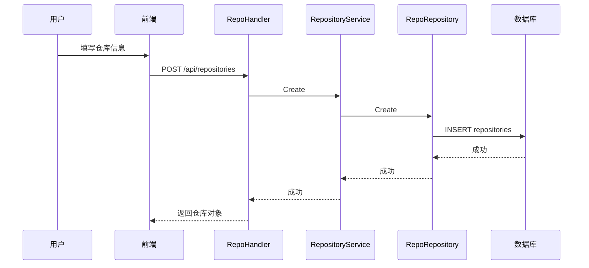
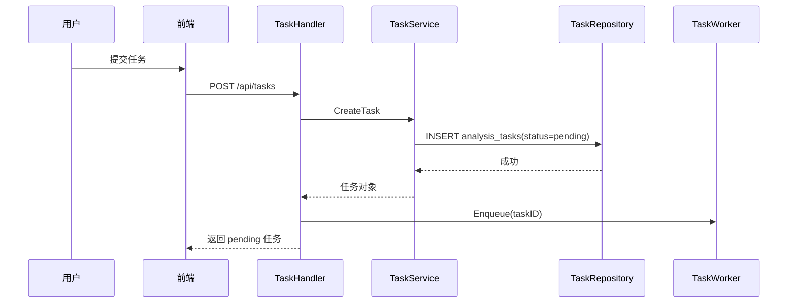
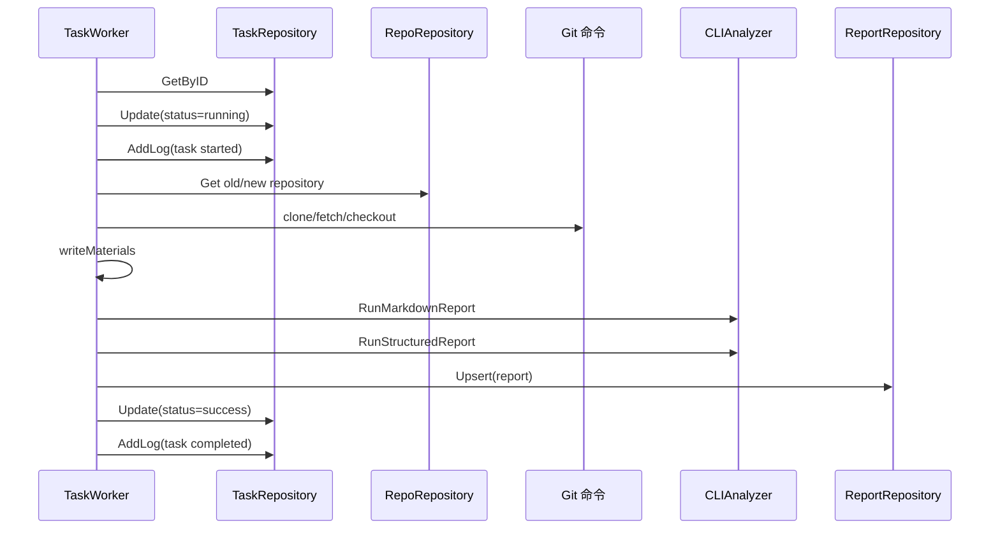
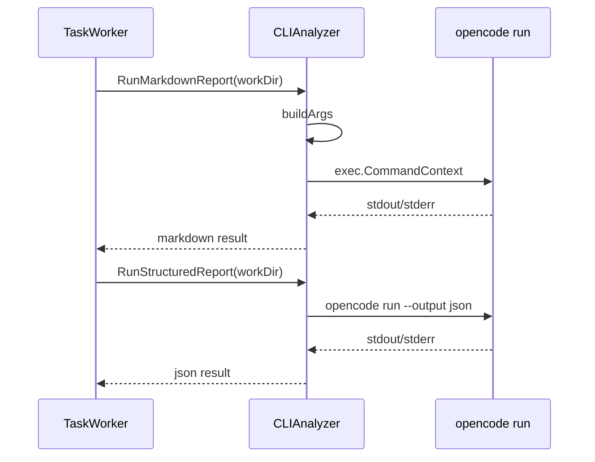
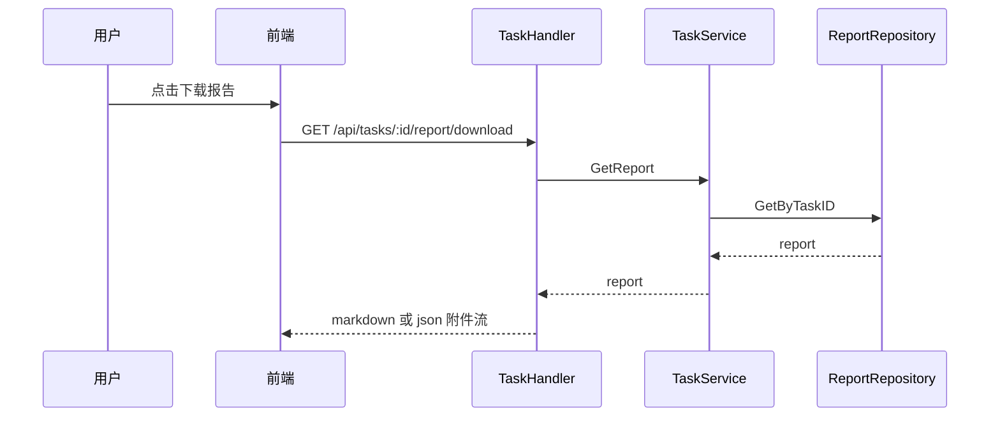

# 时序图

## 用户登录时序图

说明：

- `mixed` 模式下会先查 `config_users`，再查数据库。
- 配置用户登录成功时，`user_id` 为 `0`。

## 创建仓库记录时序图

说明：创建仓库记录只写数据库，不会自动执行 `git clone`。

## 创建分析任务时序图

说明：HTTP 返回成功后，任务才开始进入异步执行阶段。

## Worker 执行任务时序图

说明：如果 Markdown 生成失败，任务会直接失败；结构化 JSON 失败不会让任务整体失败。

## OpenCode 分析调用时序图

说明：工作目录内必须已有 prompt 和分析材料，CLIAnalyzer 不会自行生成这些文件。

## 下载报告时序图

说明：下载接口直接从数据库读取报告正文，不依赖磁盘文件。
