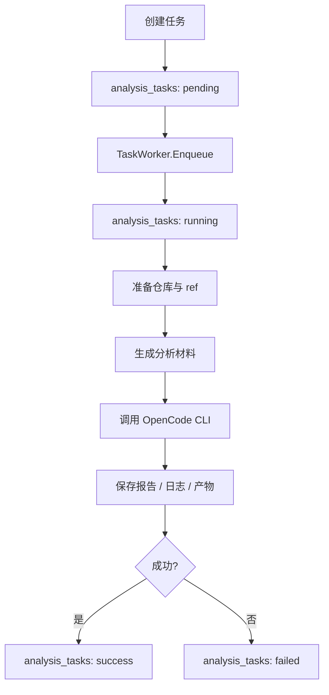

# 任务流转说明

## 总体流程

## 详细步骤

### 1. 用户提交任务

- 入口：`POST /api/tasks`
- 处理器：`TaskHandler.Create`
- 行为：
  - 绑定请求体
  - 从 JWT 读取 `user_id`
  - 调用 `TaskService.CreateTask`

### 2. 任务入库

`TaskService.CreateTask` 会把任务状态强制设置为 `pending`，然后写入 `analysis_tasks`。

### 3. 任务入队

`TaskWorker.Enqueue` 直接启动一个 goroutine 执行 `process`。这意味着：

- 当前没有外部消息队列。
- 服务重启会打断正在运行的任务。

### 4. 任务切换到 running

worker 读取任务后：

- 把任务状态改为 `running`
- 写入一条 `task started` 日志

### 5. 准备仓库

worker 会分别读取 `old_repo_id` 和 `new_repo_id` 对应仓库，然后对两边都执行：

- 若缓存目录没有 `.git`，先 `git clone`
- 执行 `git fetch --all --prune`
- 执行 `git checkout <ref>`

注意：

- 任务会直接修改 `local_cache_dir` 的工作树状态。
- 同一仓库的并发任务可能互相切换 ref。

### 6. 生成分析材料

worker 会在 `workdir.artifacts` 下创建一个形如 `task_<id>_<timestamp>` 的目录，并生成以下文件：

- `changed_files.txt`
- `diff.patch`
- `commit_log.txt`
- `repo_manifest.md`
- `analysis_prompt.md`
- `analysis_prompt_json.md`

### 7. 调用 OpenCode

执行器：`CLIAnalyzer`

调用形式：

- Markdown：`opencode run --prompt-file analysis_prompt.md`
- JSON：`opencode run --output json --prompt-file analysis_prompt_json.md`

如果配置了：

- `attach_url`，会加 `--attach`
- `default_model`，会加 `--model`
- `default_agent`，会加 `--agent`

### 8. 保存报告

Markdown 与结构化 JSON 的结果最终会保存到 `analysis_reports`。

同时：

- `raw_stdout` 保存两类结果拼接后的原始输出
- `raw_stderr` 保存错误输出

### 9. 完成或失败

成功：

- 任务更新为 `success`
- 写入 `task completed`

失败：

- 任务更新为 `failed`
- `error_message` 保存错误信息
- 追加 `ERROR` 日志

## 关键中间产物说明

### `changed_files.txt`

- 来源：`git diff --name-only`
- 用途：让分析器快速感知改动范围

### `diff.patch`

- 来源：`git diff`
- 用途：提供完整代码差异

### `commit_log.txt`

- 来源：`git log --oneline old..new`
- 用途：帮助分析器理解提交上下文

### `repo_manifest.md`

- 来源：worker 生成
- 内容：old/new ref 与仓库路径

### `analysis_prompt.md`

- 来源：worker 生成
- 内容：要求 OpenCode 产出 Markdown 影响分析报告

### `analysis_prompt_json.md`

- 来源：worker 生成
- 内容：要求 OpenCode 输出结构化 JSON 字段

## 失败时的处理逻辑

- 仓库不存在：任务失败
- git clone/fetch/checkout 失败：任务失败
- Markdown 报告生成失败：任务失败，但会尽量保存原始 stdout/stderr
- 结构化报告生成失败：当前不会让任务整体失败，只是结构化结果可能为空

## 重试、回查、日志查看方式

当前代码中：

- 没有自动重试
- 没有“重新执行任务”接口
- 回查方式主要依赖：
  - `GET /api/tasks/:id`
  - `GET /api/tasks/:id/logs`
  - `GET /api/tasks/:id/report`
  - `GET /api/tasks/:id/report/download`

如果需要重试，只能重新创建一个新任务。
